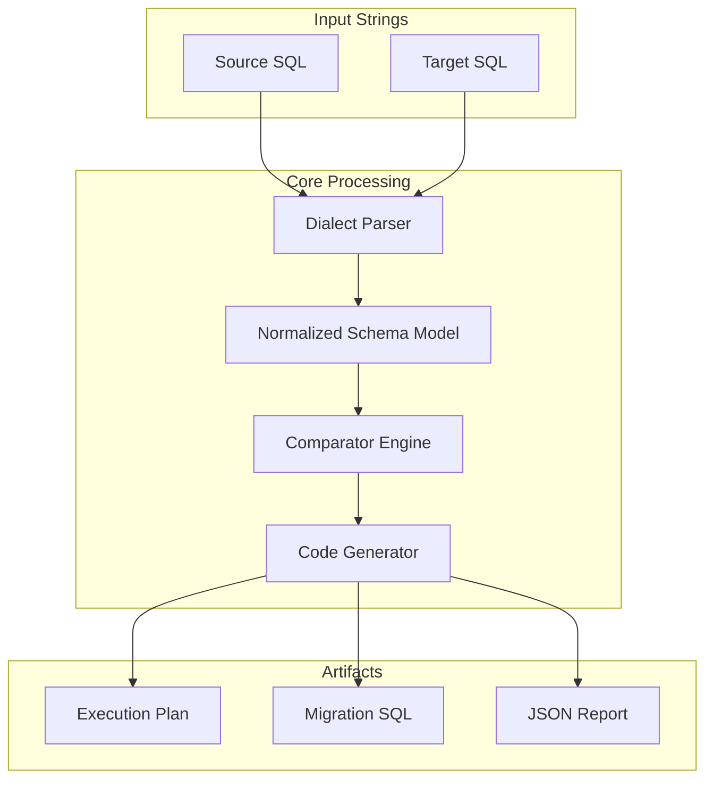

# SchemaForge: Enterprise Database Infrastructure as Code

SchemaForge is an industrial-grade engine for managing database schemas as software artifacts. It adheres to the principles of Infrastructure as Code (IaC), enabling reliable, repeatable, and audit-ready database modifications in high-compliance environments.

Designed for the rigor of financial, healthcare, and government sectors, SchemaForge eliminates configuration drift by ensuring the declared schema state in your version control system exactly matches the target database environment.

---

## Core Enterprise Capabilities

### 1. Immutable Infrastructure & Zero Drift
SchemaForge treats database schemas as immutable definitions. By comparing your Git-based schema definition against the target state, it generates deterministic migration plans. This guarantees that running the same migration multiple times results in the same final state (Idempotency).

### 2. Air-Gap & High Security Compliance
SchemaForge operates in a strict **Offline-Only** mode.
*   **No Outbound Connectivity:** The CLI performs no network calls, telemetry collection, or remote version checks.
*   **Sensitive Data Protection:** Schema definitions are processed locally on your secure infrastructure.
*   **CI/CD Integration:** Produces machine-readable JSON artifacts for integration with enterprise pipelines (Jenkins, GitHub Actions, GitLab CI).

### 3. Mainframe-Grade Precision
Support extends beyond standard SQL to include legacy and storage-specific definitions critical for banking and insurance systems:
*   **DB2 z/OS Support:** Native handling of `STOGROUP`, `PRIQTY`, `SECQTY`, and `CCSID` parameters.
*   **Temporal Compliance:** Full parsing of `PERIOD FOR SYSTEM_TIME` for audit logging requirements.
*   **Decimal Precision:** Validated against `DECIMAL(31, 10)` and `DECFLOAT` types for financial calculations.

---

## Supported Dialects

SchemaForge provides deep support for the following enterprise database platforms:

| Platform | Key Features Supported |
| :--- | :--- |
| **IBM DB2 (z/OS)** | `TABLESPACE`, `AUX TABLE`, `HISTORY TABLE`, `STOGROUP`, `PARTITION BY RANGE` |
| **Snowflake** | `DYNAMIC TABLE`, `ICEBERG`, `TRANSIENT`, `CLUSTER BY`, `DATA_RETENTION_TIME` |
| **PostgreSQL** | `UNLOGGED`, `PARTITION BY RANGE/LIST/HASH`, `RLS` (Row Level Security) |
| **Oracle** | `IOT` (Index Organized Tables), `PARTITION BY RANGE/HASH`, `VPD` |
| **MySQL** | `InnoDB` Engine parameters, `FULLTEXT` Indexes |
| **SQLite** | `STRICT` Tables, `WITHOUT ROWID` optimizations |

---

## Installation

### Option 1: Standalone Binary (Recommended for Production)
For production deployment in CI/CD pipelines, use the pre-compiled standalone binaries. These require no runtime dependencies.

1.  Download the appropriate binary for your architecture from the [Releases Page](https://github.com/structlabsinc/schemaforge/releases).
    *   `sf-linux-amd64`
    *   `sf-windows-amd64.exe`
2.  Verify the checksum against the published SHA256 hash.
3.  Place the binary in your system `$PATH`.

### Option 2: Build from Source
For security auditing or internal development:

1.  Clone the repository:
    ```bash
    git clone https://github.com/structlabsinc/schemaforge.git
    cd schemaforge
    ```

2.  Create an isolated environment:
    ```bash
    python3 -m venv venv
    source venv/bin/activate
    ```

3.  Install dependencies:
    ```bash
    pip install -r requirements.txt
    ```

---

## Usage Guide

SchemaForge is a Command Line Interface (CLI) tool. All operations are local file comparisons.

### Basic Comparison
Compare a local source file against a target definition to generate a migration plan.

```bash
sf compare --source ./schema/v1.sql --target ./schema/v2.sql --dialect postgres --plan
```

### Generating Migration Scripts
To produce a deployable SQL artifact:

```bash
sf compare \
  --source ./schema/prod_snapshot.sql \
  --target ./schema/feature_branch.sql \
  --dialect snowflake \
  --sql-out ./artifacts/V1.5__migration.sql
```

### Generating Rollback Scripts
For environments requiring automated rollback capabilities:

```bash
sf compare \
  --source ./schema/v1.sql \
  --target ./schema/v2.sql \
  --dialect db2 \
  --generate-rollback \
  --sql-out ./artifacts/deploy.sql \
  --rollback-out ./artifacts/rollback.sql
```

### Strict Mode Validation
Enforce strict parsing rules to fail the build upon encountering any unrecognized SQL syntax, ensuring 100% schema comprehension.

```bash
sf compare --source ./schema/v1.sql --target ./schema/v2.sql --dialect oracle --strict
```

---

## CLI Configuration Reference

| Flag | Description |
| :--- | :--- |
| `--source` | **Required.** Path to the source schema file or directory. |
| `--target` | **Required.** Path to the target (desired) schema file or directory. |
| `--dialect` | **Required.** Target database dialect (`db2`, `snowflake`, `postgres`, `oracle`, `mysql`, `sqlite`). |
| `--plan` | Output a human-readable execution plan to STDOUT. |
| `--sql-out` | Path to write the forward migration SQL script. |
| `--json-out` | Path to write the JSON analysis report (for CI/CD gating). |
| `--strict` | Enable strict parsing mode (fails on warnings). |
| `--generate-rollback` | Generate a reversal script alongside the migration. |
| `--rollback-out` | Path to write the rollback SQL script. |
| `--no-color` | Disable ANSI output for log compatibility. |
| `-v` / `-vv` | Set logging verbosity (INFO / DEBUG). |

---

## Architecture

SchemaForge utilizes a modular pipeline architecture to decouple parsing, comparison, and generation logic.



---

## Support

SchemaForge is maintained by Struct Labs Inc. For enterprise support, custom dialect implementation, or SLA-backed assistance, please contact your account representative.

**License:** Apache 2.0
