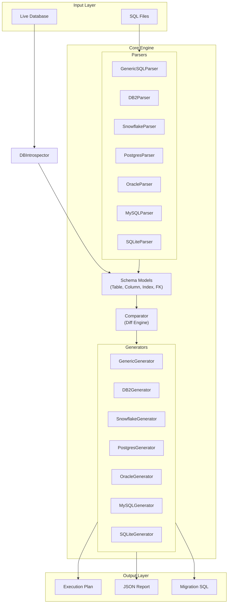

# SchemaForge - Database as Code


**SchemaForge** is the definitive enterprise-grade engine for Schema Management. It treats your database schema as a first-class software artifact, enabling "Infrastructure as Code" for your most critical data assets.

Designed for high-compliance environments (Banking, Healthcare, Government), SchemaForge ensures that what you declare in code is **exactly** what exists in your database - down to the byte-level storage parameter.

---

## Key Differentiators

### 1. Mainframe-Grade Precision (DB2 z/OS)
We don't just speak "SQL"; we speak **Storage**.
*   **Legacy Preservation**: We parse and respect 20-year old storage definitions (`USING STOGROUP`, `PRIQTY`, `SECQTY`, `CCSID`).
*   **Compliance Ready**: Native support for **System-Period Temporal Tables** (`PERIOD FOR SYSTEM_TIME`) for audit trails.
*   **Financial Accuracy**: Rigorously tested against `DECIMAL(31, 10)` and `DECFLOAT` for zero-rounding-error environments.

### 2. Battle-Hardened Reliability
*   **575 Tests**: Our comprehensive test suite covers edge cases including invisible characters, SQL injection-like patterns, and mixed-case quoting.
*   **72% Code Coverage**: Enterprise-grade test coverage with all critical paths tested.
*   **Idempotency Guarantee**: Running a generated migration against the target state results in **Zero Drift**.
*   **Zero Regressions**: Every release passes a comprehensive regression suite.

---

## Supported Dialects and Feature Matrix

SchemaForge goes beyond basic `CREATE TABLE`. We support the "Features" that make each database unique.

| Feature Category | **DB2 (z/OS)** | **Snowflake** | **PostgreSQL** | **Oracle** | **MySQL** | **SQLite** |
| :--- | :--- | :--- | :--- | :--- | :--- | :--- |
| **Storage Model** | `TABLESPACE`, `DATABASE`, `STOGROUP`, `PRIQTY/SECQTY` | Micro-partitions (Auto) | `TABLESPACE` | `TABLESPACE`, `PCTFREE` | Engine (`InnoDB`) | File-based |
| **Table Types** | Standard, `AUX TABLE` (LOBs), `HISTORY TABLE` | `DYNAMIC`, `ICEBERG`, `TRANSIENT`, `HYBRID`, `EVENT` | Standard, `UNLOGGED`, `PARTITIONED`, `FOREIGN` | Standard, `IOT` (Index Organized) | Standard | `STRICT`, `VIRTUAL` |
| **Partitioning** | `PARTITION BY RANGE` (Table-Controlled) | `CLUSTER BY` (Micro-partitioning) | `PARTITION BY RANGE/LIST/HASH` | `PARTITION BY RANGE/HASH` | `PARTITION BY RANGE/HASH` | N/A |
| **Temporal / Time** | **System-Period Temporal Tables** | Time Travel (Retention) | Extensions (Temporal Tables) | Flashback Query | N/A | N/A |
| **Views** | Standard, Materialized (MQT) | Standard, `MATERIALIZED`, `SECURE` | Standard, `MATERIALIZED` | Standard, `MATERIALIZED` | Standard | Standard |
| **Governance** | `AUDIT`, `CCSID` (Encoding) | `MASKING POLICIES`, `ROW ACCESS POLICIES`, `TAGS` | `ROW LEVEL SECURITY (RLS)`, `GRANT`/`REVOKE` | VPD (Virtual Private Database) | Grants | N/A |
| **Procedural** | Stored Procs (managed as object) | `PROCEDURE`, `FUNCTION` (Java/Python/SQL) | `FUNCTION`, `PROCEDURE`, `TRIGGER` | `PACKAGE`, `PROCEDURE`, `SYNONYM` | `PROCEDURE`, `FUNCTION`, `TRIGGER` | `TRIGGER` |
| **Constraints** | `PK`, `FK` (Enforced), `CHECK` | `PK`, `FK`, `UNIQUE` (Informational) | `PK`, `FK`, `CHECK`, `EXCLUSION` | `PK`, `FK`, `CHECK` | `PK`, `FK` | `PK`, `FK`, `CHECK` |
| **Indices** | `CLUSTER`, `PARTITIONED`, `INCLUDE` | N/A (Auto-indexed) | `BTREE`, `GIN`, `GIST`, `PARTIAL` | `BITMAP`, `B-TREE`, `REVERSE` | `BTREE`, `FULLTEXT` | Standard |

---

## Security and Privacy: Zero Telemetry

**SchemaForge is Air-Gap Ready.**

*   **100% Local Execution**: All parsing, diffing, and generation logic runs entirely on your local machine or build agent.
*   **No Network Calls**: The CLI makes **zero** outbound network requests. It does not check for updates, send usage stats, or upload schemas.
*   **Safe for Sensitive Data**: Whether you are calculating nuclear throw-weights or processing HIPAA data, your schema definitions never leave your infrastructure.

---

## Architecture

SchemaForge follows a modular, extensible architecture designed for enterprise maintainability.



### Component Overview

| Component | Purpose |
|-----------|---------|
| **Parsers** | Parse SQL DDL into normalized `Schema` objects. Each dialect extends `GenericSQLParser`. |
| **Models** | Dataclasses representing database objects (`Table`, `Column`, `Index`, `ForeignKey`, etc.) |
| **Comparator** | Compares two `Schema` objects and produces a `MigrationPlan` with diffs. |
| **Generators** | Convert `MigrationPlan` into dialect-specific DDL statements. |
| **Introspector** | Connects to live databases via SQLAlchemy to extract current schema state. |

---

## Observability and Debugging

SchemaForge provides enterprise-grade logging for troubleshooting and CI/CD integration.

### Log Levels

| Flag | Level | Use Case |
|------|-------|----------|
| (none) | WARNING | Production - errors and warnings only |
| `-v` | INFO | Normal operation with status messages |
| `-vv` | DEBUG | Full debugging with parsed table names, tokens |

### Log Formats

```bash
# Human-readable (default)
sf compare --source v1.sql --target v2.sql --dialect postgres -v

# JSON format for CI/CD pipelines
sf compare --source v1.sql --target v2.sql --dialect postgres -v --log-format json
```

**JSON Log Example:**
```json
{"timestamp": "2025-12-27T12:30:00Z", "level": "DEBUG", "logger": "schemaforge.parser", "message": "Extracted Table Name: users"}
```

---

## Installation and Setup

### Option 1: Standalone Binary (Production)
The recommended way for CI/CD agents and local usage. **No Python or dependencies required.**

1.  **Download**: Navigate to the [Releases Page](https://github.com/structlabsinc/schemaforge/releases) and grab the binary for your OS.
    *   Linux: `sf-linux-amd64`
    *   Windows: `sf-windows-amd64.exe`
    *   macOS: `sf-macos-amd64`

2.  **Install (Linux/macOS)**:
    Make the binary executable and move it to your path:
    ```bash
    chmod +x sf-linux-amd64
    sudo mv sf-linux-amd64 /usr/local/bin/sf
    
    # Verify installation
    sf --version
    ```

3.  **Install (Windows)**:
    *   Rename the downloaded file to `sf.exe`.
    *   Move it to a folder in your System PATH (e.g., `C:\Program Files\SchemaForge\`).
    *   Open PowerShell and run `sf --version`.

### Option 2: Build from Source (Development)
For security reviews, custom modifications, or internal distributions.

1.  **Clone the Repository**:
    ```bash
    git clone https://github.com/structlabsinc/schemaforge.git
    cd schemaforge
    ```

2.  **Setup Environment**:
    We recommend using a virtual environment to keep dependencies isolated.
    ```bash
    python3 -m venv venv
    source venv/bin/activate  # On Windows: .\venv\Scripts\activate
    ```

3.  **Install Dependencies**:
    ```bash
    pip install -r requirements.txt
    ```

4.  **Run via CLI**:
    You can now run the tool directly through the Python interpreter:
    ```bash
    python3 schemaforge/main.py --help
    ```

---

## CLI Command Reference

The `sf` (or `schemaforge`) tool supports two primary commands: `compare` (File-to-File) and `compare-livedb` (DB-to-File).

### Global Flags

| Flag | Required | Description | Example |
| :--- | :--- | :--- | :--- |
| `--source` | **Yes** | Path to the SOURCE schema file (or Database Connection URL for `compare-livedb`). | `--source v1.sql` / `--source "postgresql://..."` |
| `--target` | **Yes** | Path to the TARGET schema file (the desired state). | `--target v2.sql` |
| `--dialect` | **Yes** | The SQL dialect of the files/database. Options: `db2`, `snowflake`, `postgres`, `oracle`, `mysql`, `sqlite`. | `--dialect db2` |
| `--plan` | No | Outputs a human-readable execution plan to STDOUT. Essential for verification before applying changes. | `--plan` |
| `--sql-out` | No | Path to save the generated SQL migration script. If omitted, no SQL is saved. | `--sql-out migration.sql` |
| `--json-out` | No | Path to save a machine-readable JSON representation of the plan. Useful for CI/CD gates. | `--json-out plan.json` |
| `--object-types` | No | **(LiveDB Only)** Comma-separated list of objects to inspect. Defaults to `table`. | `--object-types table,view,procedure` |
| `--no-color` | No | Disables ANSI color codes in output. Use this for CI logs that don't support color. | `--no-color` |
| `--verbose` / `-v` | No | Enables verbose logging (DEBUG level) depending on frequency. | `-v` |
| `--version` | No | Prints the version number and exits. | `--version` |

### Comparison Modes

*   `sf compare`: Uses two local SQL files (or directories) to generate a diff. Fast and purely offline.
*   `sf compare-livedb`: Connects to a running database (Source) and compares it against a local file/directory (Target). Requires network access to the DB.

---

## Comprehensive Workflow Example

### Scenario: The "Banking Compliance" Migration

You are migrating a legacy Mainframe Finance schema to a modern CI/CD pipeline while strictly maintaining regulatory compliance.

#### 1. The Source: A Complex "God Object" (v1.sql)
This file defines a temporal table with high-precision decimals and specific storage allocation.

```sql
-- v1.sql
CREATE TABLE "transactions" (
  "trans_id" BIGINT GENERATED ALWAYS AS IDENTITY,
  "account_id" CHAR(10) NOT NULL,
  "amount" DECIMAL(31, 10) NOT NULL, -- Financial Precision
  "sys_start" TIMESTAMP(12) NOT NULL GENERATED ALWAYS AS ROW BEGIN,
  "sys_end" TIMESTAMP(12) NOT NULL GENERATED ALWAYS AS ROW END,
  "trans_ts" TIMESTAMP(12) GENERATED ALWAYS AS TRANSACTION START ID,
  CONSTRAINT "pk_trans" PRIMARY KEY ("trans_id", "sys_start"),
  PERIOD FOR SYSTEM_TIME ("sys_start", "sys_end")
) IN DATABASE "db_fin"."ts_trans"
  USING STOGROUP "sg_fast"
  PRIQTY 500 SECQTY 50
  CCSID EBCDIC; -- Mainframe Encoding

CREATE TABLE "transactions_hist" (
  "trans_id" BIGINT NOT NULL,
  "account_id" CHAR(10) NOT NULL,
  "amount" DECIMAL(31, 10) NOT NULL,
  "sys_start" TIMESTAMP(12) NOT NULL,
  "sys_end" TIMESTAMP(12) NOT NULL,
  "trans_ts" TIMESTAMP(12) NOT NULL
) IN DATABASE "db_fin"."ts_hist";

-- Link Temporal History
ALTER TABLE "transactions" ADD VERSIONING USE HISTORY TABLE "transactions_hist";
```

#### 2. The Change: New Risk Requirement (v2.sql)
The "Risk" department requires a new `risk_score` column and a supporting index.

```sql
-- v2.sql (Differences from v1)
...
  "amount" DECIMAL(31, 10) NOT NULL,
  "risk_score" DECFLOAT(16), -- NEW COLUMN
...

-- NEW INDEX
CREATE INDEX "idx_trans_risk" ON "transactions" ("account_id") 
  INCLUDE ("risk_score", "amount") 
  CLUSTER;
```

#### 3. The Execution: Generate Safe Migration
Run SchemaForge to generate the diff.

```bash
sf compare --source v1.sql --target v2.sql --dialect db2 --plan --sql-out migration.sql
```

**Output Plan (Human Readable):**
```text
[PLAN] Migration Analysis for DB2
------------------------------------------------------------
[MODIFY] TABLE "transactions"
  + ADD COLUMN "risk_score" DECFLOAT(16)
  
[CREATE] INDEX "idx_trans_risk" ON "transactions"
  > Columns: ("account_id")
  > Include: ("risk_score", "amount")
  > Attributes: CLUSTER
------------------------------------------------------------
No destructive changes detected. Safe to apply.
```

---

## Governance and License
SchemaForge is open-source under the **Apache 2.0** license.
Developed by **Struct Labs Inc.** for the Enterprise.

See [CHANGELOG.md](CHANGELOG.md) for version history.
